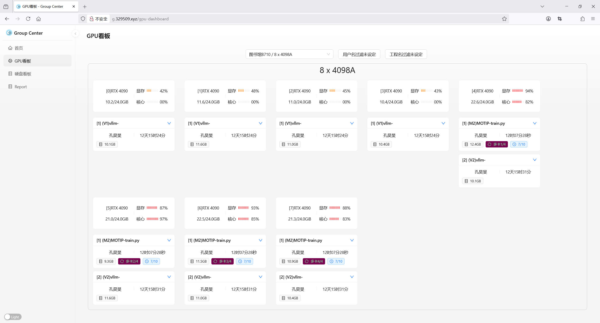
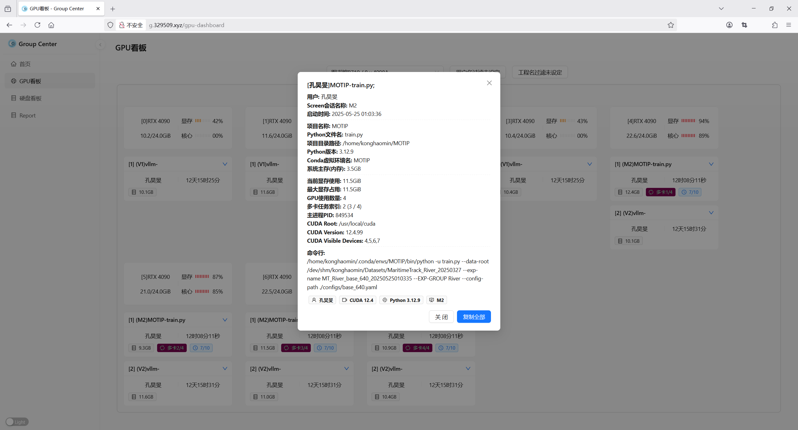

# Group-Center-Dashboard

## Getting Started





## Notices

You can use `pnpm` and `WebPack` on Windows.

`Bun` and `Mako` is only for macOS and Linux.

## Install Environment

### HomeBrew

#### Install HomeBrew

https://brew.sh/

#### Mirrors

https://mirrors.tuna.tsinghua.edu.cn/help/homebrew/

#### Install Software

```bash
brew install node pnpm bun
```

### Node Config

#### Change Mirrors via nrm

```bash
npm i -g nrm
nrm use taobao
```

#### Check Update

```bash
npm i -g npm-check-updates
ncu -u
```

## Bun

### Install Package

```bash
bun install
```

### Run

```bash
bun dev
```

## Create Project

### Alibaba Umi

### Mako

Use `mako` for umi on macOS/Linux

```bash
npx umi config set mako {}
```

## Ref

https://umijs.org/

https://ant-design.antgroup.com/index-cn

https://makojs.dev/zh-CN

`@umijs/max` 模板项目，更多功能参考 [Umi Max 简介](https://umijs.org/docs/max/introduce)
